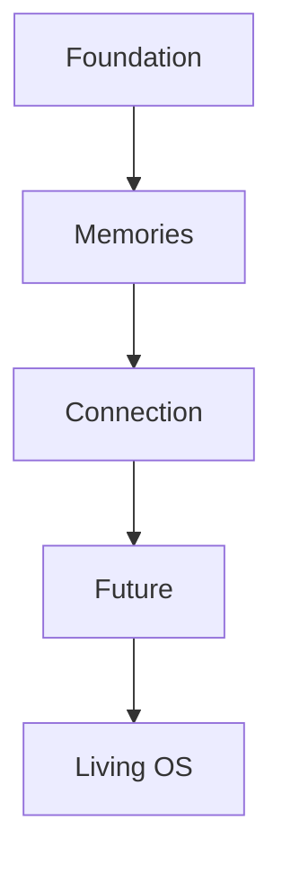

# Mariana OS — Product Roadmap

> _"Un buen producto no se construye agregando todo desde el principio. Se construye entregando valor de manera progresiva y coherente."_

---

# 1. Objetivo

Este Roadmap define la evolución planificada de Mariana OS desde su concepción hasta convertirse en una plataforma interactiva completa.

No representa una planificación rígida basada en fechas.

Representa una estrategia de crecimiento basada en capacidades.

Cada etapa añade valor al producto sin comprometer los principios definidos en:

- 000-product-vision.md
- 001-product-principles.md

---

# 2. Estrategia

El desarrollo seguirá una filosofía incremental.

Cada etapa debe producir un sistema funcional.

Nunca existirá una fase cuyo único resultado sea código incompleto o inaccesible para el usuario.

Al finalizar cada Era, Mariana OS deberá poder ejecutarse y demostrar una experiencia coherente.

---

# 3. Eras del producto

| Era                  | Estado             | Objetivo principal                        |
| -------------------- | ------------------ | ----------------------------------------- |
| Era I — Foundation   | MVP                | Construir el núcleo del sistema operativo |
| Era II — Memories    | Release            | Incorporar contenido emocional            |
| Era III — Connection | Release            | Hacer que la experiencia cobre vida       |
| Era IV — Future      | Release            | Construir recuerdos futuros               |
| Era V — Living OS    | Evolución continua | Mantener el producto vivo                 |

---

# 4. Era I — Foundation

## Objetivo

Construir toda la infraestructura necesaria para que Mariana OS funcione como un sistema operativo interactivo.

### Incluye

- Desktop
- Window Manager
- Barra de tareas
- Dock
- Menú principal
- Sistema de ventanas
- Gestión de estados
- Sistema de temas
- Persistencia básica
- Arquitectura base
- Diseño del Design System

### Resultado esperado

El usuario puede navegar por un escritorio completamente funcional, aunque todavía no existan recuerdos reales.

---

# 5. Era II — Memories

## Objetivo

Transformar el escritorio en un espacio personal.

### Nuevos módulos

- Álbum
- Fotografías
- Cartas
- Línea del tiempo
- Galería
- Visor multimedia

### Resultado esperado

Mariana puede comenzar a explorar la historia compartida.

---

# 6. Era III — Connection

## Objetivo

Dotar al sistema de personalidad.

### Funcionalidades

- Animaciones narrativas
- Sonidos ambientales
- Música
- Transiciones emocionales
- Easter Eggs
- Interacciones especiales
- Eventos según fechas

### Resultado esperado

El sistema deja de sentirse como una aplicación y comienza a transmitir emociones mediante sus interacciones.

---

# 7. Era IV — Future

## Objetivo

Permitir que Mariana OS también represente el futuro.

### Nuevos módulos

- Sueños compartidos
- Metas
- Bucket List
- Logros
- Calendario de momentos importantes
- Cápsulas del tiempo
- Mensajes programados

### Resultado esperado

El producto deja de documentar únicamente el pasado y comienza a acompañar el futuro.

---

# 8. Era V — Living OS

## Objetivo

Convertir Mariana OS en una plataforma viva.

### Posibles funcionalidades

- Nuevos módulos
- Mejoras visuales
- Personalización
- Nuevas historias
- Colecciones
- Estadísticas personales
- Integraciones futuras

No existe una fecha de finalización para esta etapa.

Mariana OS evolucionará junto con la historia que representa.

---

# 9. Dependencias estratégicas

Cada Era depende de la estabilidad alcanzada en la anterior.

No deben desarrollarse funcionalidades de una Era superior mientras existan problemas estructurales pendientes en la anterior.

---

# 10. Hitos principales

| Hito | Resultado                               |
| ---- | --------------------------------------- |
| H1   | Arquitectura estable                    |
| H2   | Escritorio completamente funcional      |
| H3   | Primer módulo operativo                 |
| H4   | Primera experiencia emocional completa  |
| H5   | Integración backend completa            |
| H6   | MVP terminado                           |
| H7   | Primera versión pública para portafolio |
| H8   | Entrega oficial a Mariana               |

---

# 11. Criterios de avance

Una Era solo podrá considerarse finalizada cuando:

- Todos sus objetivos estén implementados.
- La experiencia sea estable.
- No existan errores críticos.
- La documentación correspondiente esté actualizada.
- Los principios del producto continúen respetándose.

---

# 12. Riesgos identificados

| Riesgo                          | Mitigación                                  |
| ------------------------------- | ------------------------------------------- |
| Sobrediseñar el sistema         | Priorizar simplicidad                       |
| Incorporar demasiadas funciones | Seguir estrictamente el Roadmap             |
| Perder el enfoque emocional     | Revisar la Product Vision antes de cada Era |
| Acoplamiento excesivo           | Mantener arquitectura modular               |
| Crecimiento descontrolado       | Validar nuevas funcionalidades mediante ADR |

---

# 13. Definición de MVP

El MVP de Mariana OS estará compuesto por:

- Desktop funcional.
- Sistema de ventanas.
- Barra de tareas.
- Menú principal.
- Gestor de aplicaciones.
- Álbum.
- Fotografías.
- Cartas.
- Timeline.
- Backend operativo.
- Persistencia de datos.
- Autenticación (si se considera necesaria para administración).
- Diseño consistente.
- Documentación completa.

Todo lo demás será considerado evolución del producto.

---

# 14. Visión a largo plazo

Mariana OS no busca alcanzar una versión "final".

Su propósito es evolucionar junto con la historia que representa.

Cada nueva experiencia compartida podrá incorporarse como un nuevo capítulo dentro del sistema, permitiendo que el producto permanezca vivo durante años sin perder su identidad.
