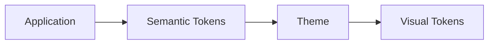
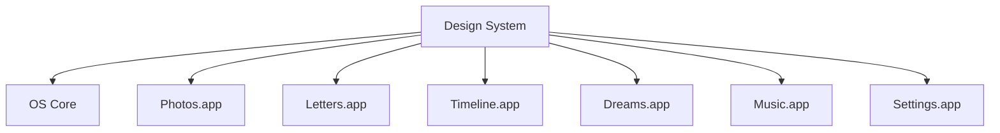

# Mariana OS — Design System

> _"La interfaz es el espacio donde la tecnología y la emoción se encuentran."_

---

# 1. Propósito

Este documento define el lenguaje visual de Mariana OS.

Su objetivo es establecer una fuente única de verdad para las decisiones relacionadas con:

- identidad visual;
- composición;
- tipografía;
- color;
- espaciado;
- profundidad;
- superficies;
- iconografía;
- movimiento;
- estados;
- accesibilidad;
- temas.

El Design System debe garantizar que todas las aplicaciones de Mariana OS parezcan pertenecer al mismo sistema.

---

# 2. Objetivos

El Design System debe:

1. Crear una identidad visual reconocible.
2. Mantener coherencia entre aplicaciones.
3. Facilitar la creación de nuevas aplicaciones.
4. Reducir decisiones visuales arbitrarias.
5. Permitir evolución futura.
6. Favorecer accesibilidad.
7. Reforzar la narrativa emocional.
8. Mantener una estética tecnológica sin perder calidez.

---

# 3. Principios de Diseño

## D1. Tecnología al servicio de la emoción

La interfaz debe potenciar el contenido emocional.

La tecnología nunca debe competir con él.

---

## D2. Claridad antes que decoración

Cada elemento visual debe tener una función.

Si un elemento no ayuda a comprender, navegar o sentir la experiencia, debe cuestionarse su existencia.

---

## D3. Profundidad con propósito

Las ventanas, overlays y superficies deben utilizar profundidad para comunicar jerarquía.

No se utilizarán sombras únicamente como decoración.

---

## D4. Movimiento significativo

Las animaciones deben comunicar:

- entrada;
- salida;
- cambio de contexto;
- jerarquía;
- continuidad;
- respuesta.

---

## D5. Consistencia

Una misma acción debe producir comportamientos visuales similares en todo el sistema.

---

## D6. Personalidad sin saturación

Mariana OS debe tener una identidad propia sin depender de efectos visuales excesivos.

---

# 4. Identidad Visual

Mariana OS utilizará una identidad basada en cuatro conceptos:

```text
                 Mariana OS

                     │
       ┌─────────────┼─────────────┐
       │             │             │
   Technology     Emotion       Memory
       │             │             │
       └─────────────┼─────────────┘
                     │
                  Future
```

La combinación debe producir una experiencia:

- elegante;
- íntima;
- tecnológica;
- nostálgica;
- moderna;
- tranquila.

---

# 5. Lenguaje Visual

La interfaz se inspira conceptualmente en:

- sistemas operativos modernos;
- interfaces de escritorio;
- glassmorphism moderado;
- diseño editorial;
- fotografía;
- interfaces minimalistas.

Sin embargo, Mariana OS no debe convertirse en una copia de ningún sistema operativo existente.

---

# 6. Design Tokens

Todos los valores visuales relevantes deberán definirse mediante Design Tokens.

Los tokens representan decisiones semánticas y no valores arbitrarios.

Ejemplo conceptual:

```text
color.surface.primary
color.surface.secondary
color.text.primary
color.text.secondary
color.accent.primary
spacing.sm
spacing.md
spacing.lg
radius.sm
radius.md
shadow.window
motion.fast
motion.normal
```

Las aplicaciones deberán consumir tokens en lugar de definir valores directamente.

---

# 7. Color

La paleta deberá dividirse conceptualmente en:

### Surfaces

Representan superficies del sistema.

```text
surface.background
surface.primary
surface.secondary
surface.elevated
surface.overlay
```

### Content

```text
content.primary
content.secondary
content.tertiary
content.disabled
```

### Accent

```text
accent.primary
accent.secondary
accent.success
accent.warning
accent.error
```

### System

```text
system.info
system.success
system.warning
system.error
```

La paleta definitiva deberá establecerse durante la implementación del Design System.

---

# 8. Temas

Mariana OS deberá soportar inicialmente:

- Light Theme
- Dark Theme

La arquitectura deberá permitir incorporar nuevos temas posteriormente.



Las aplicaciones no deberán depender directamente de colores concretos.

---

# 9. Tipografía

La tipografía debe priorizar:

- legibilidad;
- jerarquía;
- personalidad;
- accesibilidad.

Se establecerán niveles semánticos:

| Token             | Uso                    |
| ----------------- | ---------------------- |
| `font.display`    | Elementos destacados   |
| `font.heading`    | Títulos                |
| `font.subheading` | Subtítulos             |
| `font.body`       | Contenido              |
| `font.caption`    | Información secundaria |
| `font.mono`       | Información técnica    |

La selección definitiva de fuentes deberá documentarse antes de la implementación.

---

# 10. Escala Tipográfica

Se utilizará una escala consistente.

Conceptualmente:

```text
Display
  ↓
Heading XL
  ↓
Heading L
  ↓
Heading M
  ↓
Body L
  ↓
Body M
  ↓
Body S
  ↓
Caption
```

No deberán utilizarse tamaños arbitrarios fuera de la escala salvo que exista una justificación.

---

# 11. Espaciado

El sistema utilizará una escala base consistente.

Conceptualmente:

```text
xs
sm
md
lg
xl
2xl
3xl
```

El objetivo es evitar valores arbitrarios como:

```text
13px
17px
23px
29px
```

cuando no exista una necesidad real.

---

# 12. Bordes y Radios

Los radios deberán utilizarse para comunicar la naturaleza del elemento.

Ejemplo:

| Token         | Uso                     |
| ------------- | ----------------------- |
| `radius.none` | Elementos estructurales |
| `radius.sm`   | Controles pequeños      |
| `radius.md`   | Cards                   |
| `radius.lg`   | Ventanas                |
| `radius.full` | Elementos circulares    |

Los radios excesivamente grandes deberán evitarse cuando no aporten significado.

---

# 13. Elevación

La elevación representa jerarquía espacial.

```text
Level 0
Desktop

Level 1
Panels

Level 2
Windows

Level 3
Dialogs

Level 4
Critical overlays
```

Una superficie más elevada debe representar una capa superior dentro de la experiencia.

---

# 14. Ventanas

Las ventanas son uno de los elementos principales de Mariana OS.

Cada ventana deberá comunicar:

- aplicación;
- estado;
- jerarquía;
- contexto;
- acciones disponibles.

Conceptualmente:

```text
┌──────────────────────────────────────┐
│ ●  Application                 — □ × │
├──────────────────────────────────────┤
│                                      │
│                                      │
│             Application              │
│                                      │
│                                      │
└──────────────────────────────────────┘
```

Las ventanas deberán mantener una estructura consistente independientemente de la aplicación que contengan.

---

# 15. Estados de Ventana

Una ventana podrá encontrarse en estados como:

- Normal
- Focused
- Unfocused
- Minimized
- Maximized
- Closing
- Opening

Cada estado deberá tener una representación visual coherente.

---

# 16. Motion System

Motion será tratado como parte del Design System.

Se definirán:

```text
motion.instant
motion.fast
motion.normal
motion.slow
```

Las animaciones deberán utilizar curvas consistentes.

---

# 17. Principios de Motion

### Entrada

Los elementos aparecen progresivamente.

### Salida

Los elementos abandonan el contexto de manera natural.

### Transformación

El movimiento debe explicar una relación entre estados.

### Continuidad

Los elementos relacionados visualmente deben mantener continuidad durante las transiciones.

---

# 18. Reduced Motion

Mariana OS deberá respetar las preferencias de accesibilidad relacionadas con movimiento.

Cuando el usuario solicite reducir animaciones, el sistema deberá:

- reducir duración;
- eliminar movimientos innecesarios;
- conservar cambios de estado;
- evitar efectos que puedan provocar incomodidad.

---

# 19. Iconografía

Los iconos deberán mantener:

- estilo consistente;
- peso visual uniforme;
- proporciones similares;
- tamaños normalizados.

Los iconos deberán comunicar una acción o concepto reconocible.

---

# 20. Imágenes

Las fotografías representan uno de los elementos centrales del producto.

Por ello, el sistema deberá evitar tratamientos visuales que reduzcan su importancia.

Las imágenes podrán utilizar:

- bordes;
- máscaras;
- overlays;
- transiciones;
- marcos;
- metadata.

Pero el contenido original deberá mantenerse como protagonista.

---

# 21. Estados de Interfaz

Todos los componentes interactivos deberán contemplar al menos:

- Default
- Hover
- Focus
- Active
- Disabled
- Loading
- Error
- Success

Los estados deberán ser consistentes entre aplicaciones.

---

# 22. Accesibilidad

El Design System deberá considerar accesibilidad desde su diseño.

Principios mínimos:

- contraste suficiente;
- navegación mediante teclado;
- focus visible;
- labels semánticos;
- soporte para reduced motion;
- tamaños táctiles adecuados;
- estructura semántica;
- compatibilidad con tecnologías asistivas.

La accesibilidad no será tratada como una fase posterior.

---

# 23. Responsive Design

Aunque Mariana OS está inspirado en un sistema operativo de escritorio, deberá contemplarse una estrategia para diferentes tamaños de pantalla.

Los modos principales serán:

```text
Desktop
Tablet
Mobile
```

Sin embargo, el comportamiento no deberá limitarse a "hacer la interfaz más pequeña".

Cada contexto deberá definir su propia experiencia.

---

# 24. Responsive Window System

Las ventanas deberán adaptar su comportamiento según el viewport.

### Desktop

```text
Floating Windows
```

### Tablet

```text
Adaptive Windows
```

### Mobile

```text
Full-screen Applications
```

La metáfora del sistema operativo se conservará, pero la interacción deberá adaptarse al dispositivo.

---

# 25. Microinteracciones

Las microinteracciones podrán utilizarse para:

- confirmar acciones;
- proporcionar feedback;
- revelar información;
- reforzar emociones;
- guiar al usuario.

No deberán utilizarse como decoración constante.

---

# 26. Empty States

Los estados vacíos deben considerarse parte de la narrativa.

En lugar de mostrar únicamente:

```text
No data.
```

podrán utilizarse mensajes contextualizados.

Por ejemplo:

```text
Todavía no hay recuerdos aquí.

Quizá el próximo capítulo
comience pronto.
```

El contenido exacto dependerá de cada aplicación.

---

# 27. Error States

Los errores deben comunicarse de manera clara pero sin romper innecesariamente la experiencia emocional.

Siempre que sea posible:

1. explicar qué ocurrió;
2. indicar qué puede hacer el usuario;
3. conservar el contexto;
4. evitar mensajes técnicos innecesarios.

---

# 28. Loading States

Los estados de carga deberán mantener la sensación de continuidad.

Se evitarán loaders excesivamente invasivos.

Cuando sea posible se utilizarán:

- skeletons;
- progressive loading;
- transitions;
- placeholders contextuales.

---

# 29. Design System y Applications

Todas las aplicaciones deberán utilizar el Design System.



Ninguna aplicación deberá crear una identidad visual completamente independiente.

---

# 30. Reglas de Extensión

Cuando una nueva aplicación necesite un patrón visual que no exista:

1. Verificar si puede reutilizar un componente existente.
2. Verificar si puede combinar componentes existentes.
3. Evaluar si el patrón debe convertirse en un nuevo componente.
4. Actualizar el Design System si el patrón es transversal.
5. Documentar la decisión cuando tenga impacto arquitectónico.

---

# 31. Anti-Patterns Visuales

Se consideran prácticas no deseadas:

- Colores arbitrarios.
- Tipografías inconsistentes.
- Animaciones sin propósito.
- Sombras excesivas.
- Glassmorphism exagerado.
- Gradientes utilizados indiscriminadamente.
- Componentes visualmente diferentes para la misma función.
- Texto ilegible.
- Falta de estados de interacción.
- Interfaces saturadas.

---

# 32. Relación con otros documentos

| Documento                   | Relación                                              |
| --------------------------- | ----------------------------------------------------- |
| `000-product-vision.md`     | Define el propósito del producto                      |
| `001-product-principles.md` | Define los principios que gobiernan el diseño         |
| `002-roadmap.md`            | Determina cuándo evolucionan las capacidades          |
| `003-architecture.md`       | Define la arquitectura que soporta el sistema         |
| `005-component-library.md`  | Implementa los componentes definidos por este sistema |
| `006-user-experience.md`    | Define cómo se experimenta el producto                |

---

# 33. Evolución

El Design System deberá evolucionar junto con Mariana OS.

Toda modificación significativa deberá:

- mantener compatibilidad;
- documentarse;
- evitar inconsistencias;
- evaluarse frente a los principios del producto.

El Design System no debe convertirse en una restricción para la creatividad.

Debe convertirse en el lenguaje común que permite que la creatividad sea consistente.

---

# 34. Principio Final

El objetivo del Design System no es hacer que Mariana OS se vea técnicamente sofisticado.

Su objetivo es crear un lenguaje visual capaz de hacer que la tecnología desaparezca cuando sea necesario y permita que la historia sea el centro de la experiencia.

> **La mejor interfaz de Mariana OS será aquella que haga que el usuario recuerde lo que sintió, no qué componente utilizó.**
