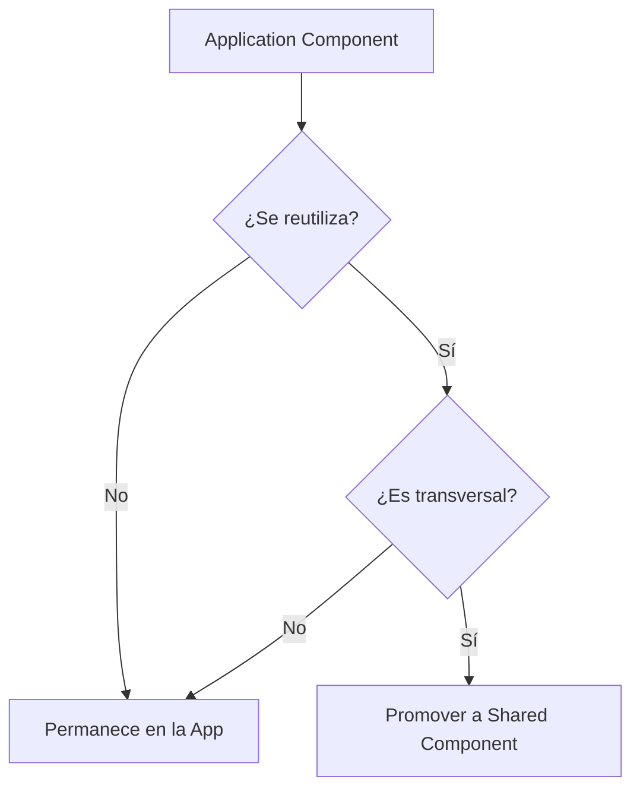
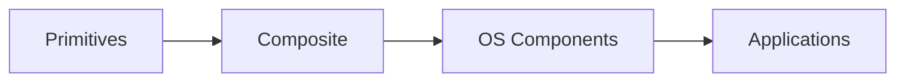

# Mariana OS — Component Library

> *"Un sistema de componentes no existe para reducir código. Existe para convertir decisiones de diseño en comportamientos consistentes."*

---

# 1. Propósito

Este documento define la Component Library de Mariana OS.

La Component Library representa la implementación conceptual del Design System y establece qué componentes reutilizables estarán disponibles para construir:

- el OS Core;
- los System Services;
- las Applications;
- futuras experiencias.

Mientras `004-design-system.md` define las reglas visuales y de interacción, este documento define las piezas reutilizables que materializan dichas reglas.

---

# 2. Objetivos

La Component Library debe:

- proporcionar componentes reutilizables;
- mantener consistencia visual;
- reducir duplicación;
- encapsular comportamiento;
- favorecer composición;
- mantener responsabilidades claras;
- facilitar la creación de nuevas aplicaciones;
- proporcionar una API consistente a los desarrolladores.

---

# 3. Relación con el Design System

La relación entre ambos documentos es:

```text
Design System
      │
      │ Define
      ▼
Tokens + Patterns + Rules
      │
      ▼
Component Library
      │
      │ Implementa
      ▼
Web Components
      │
      ▼
Applications
```

El Design System define el lenguaje.

La Component Library proporciona las palabras que permiten construir ese lenguaje.

---

# 4. Tecnología

La Component Library estará basada en:

- Web Components
- Lit
- TypeScript
- CSS nativo

Cada componente deberá ser:

- encapsulado;
- reutilizable;
- composable;
- accesible;
- independiente de una aplicación específica.

---

# 5. Principios

## C1. Composición antes que especialización

Debe preferirse combinar componentes existentes antes que crear componentes altamente específicos.

---

## C2. API mínima

Cada componente debe exponer únicamente las propiedades, atributos, métodos y eventos necesarios.

---

## C3. Componentes agnósticos

Los componentes compartidos no deben contener lógica específica de una aplicación.

Por ejemplo:

`mariana-window` no debe conocer `Photos.app`.

---

## C4. Accesibilidad por defecto

La accesibilidad forma parte del contrato del componente.

No debe depender de que cada aplicación recuerde implementarla.

---

## C5. Estados explícitos

Los componentes interactivos deben definir claramente sus estados.

---

# 6. Capas de Componentes

La biblioteca se dividirá conceptualmente en cuatro niveles.

```text
┌─────────────────────────────────┐
│ Application Components          │
├─────────────────────────────────┤
│ OS Components                   │
├─────────────────────────────────┤
│ Composite Components            │
├─────────────────────────────────┤
│ Primitive Components             │
└─────────────────────────────────┘
```

---

# 7. Primitive Components

Son los componentes más pequeños de la biblioteca.

No conocen el contexto del sistema operativo.

Ejemplos:

- Button
- Icon
- Text
- Input
- Label
- Badge
- Avatar
- Divider
- Spinner

---

## 7.1 Button

Responsabilidad:

Representar una acción ejecutable.

Estados:

- default;
- hover;
- focus;
- active;
- disabled;
- loading.

Variantes conceptuales:

```text
primary
secondary
ghost
destructive
icon
```

---

## 7.2 Icon

Responsabilidad:

Representar una acción, estado o concepto visual.

Debe permitir:

- tamaño;
- label accesible;
- estado decorativo;
- integración con botones.

---

## 7.3 Text

Responsabilidad:

Aplicar estilos tipográficos semánticos.

Debe evitarse utilizar elementos de texto genéricos para representar múltiples niveles sin intención semántica.

---

## 7.4 Input

Responsabilidad:

Capturar información textual.

Debe soportar:

- label;
- helper text;
- error;
- disabled;
- readonly;
- required.

---

# 8. Composite Components

Los Composite Components combinan primitives para crear patrones de interfaz.

Ejemplos:

- Card
- Search Field
- Form Field
- Menu
- Dropdown
- Tabs
- List
- Toolbar
- Media Card

---

## 8.1 Card

Responsabilidad:

Agrupar contenido relacionado dentro de una superficie visual.

Puede utilizarse para:

- recuerdos;
- fotografías;
- aplicaciones;
- información.

---

## 8.2 Search Field

Responsabilidad:

Permitir búsquedas dentro de una aplicación o del sistema.

Debe poder integrarse con el Search Service del Core sin depender directamente de él.

---

## 8.3 Menu

Responsabilidad:

Mostrar acciones relacionadas con un contexto.

Debe soportar:

- navegación por teclado;
- selección;
- estados disabled;
- agrupación;
- shortcuts visuales.

---

## 8.4 Tabs

Responsabilidad:

Permitir alternar entre vistas relacionadas.

Las tabs no deben utilizarse como sustituto de una navegación global.

---

# 9. OS Components

Estos componentes pertenecen específicamente a la experiencia Mariana OS.

A diferencia de los primitives, conocen conceptos del sistema operativo.

---

# 9.1 Window

El componente más importante del OS Core.

Responsabilidad:

Representar una aplicación dentro del Window Manager.

Conceptualmente:

```text
┌──────────────────────────────────────┐
│ Application Name              — □ × │
├──────────────────────────────────────┤
│                                      │
│             Application              │
│                                      │
└──────────────────────────────────────┘
```

Estados:

- opening;
- focused;
- unfocused;
- minimized;
- maximized;
- closing.

El componente no debe conocer la lógica interna de la aplicación.

---

# 9.2 Window Header

Responsabilidad:

Representar la cabecera de una ventana.

Incluye:

- icono;
- título;
- acciones;
- controles de ventana.

---

# 9.3 Window Controls

Responsabilidad:

Representar las acciones principales de una ventana.

Acciones:

- minimize;
- maximize;
- close.

---

# 9.4 Desktop

Responsabilidad:

Representar el espacio principal donde viven las ventanas y elementos del sistema.

El Desktop coordina visualmente:

- wallpaper;
- ventanas;
- widgets;
- overlays;
- elementos del sistema.

No debe contener lógica específica de ninguna aplicación.

---

# 9.5 Dock

Responsabilidad:

Proporcionar acceso rápido a aplicaciones.

Debe mostrar:

- aplicaciones disponibles;
- aplicaciones abiertas;
- aplicación activa.

---

# 9.6 Taskbar

Responsabilidad:

Representar información global y accesos del sistema.

Puede contener:

- reloj;
- estado del sistema;
- aplicaciones activas;
- acceso a menú;
- notificaciones.

---

# 9.7 App Launcher

Responsabilidad:

Permitir descubrir y ejecutar aplicaciones.

Debe interactuar con el Application Registry mediante servicios del Core.

---

# 9.8 Notification

Responsabilidad:

Mostrar información temporal del sistema.

Tipos:

- info;
- success;
- warning;
- error;
- contextual.

---

# 9.9 Notification Center

Responsabilidad:

Agrupar y consultar notificaciones existentes.

Debe mantener separación entre:

- presentación;
- almacenamiento;
- reglas de negocio.

---

# 9.10 Dialog

Responsabilidad:

Interrumpir temporalmente el flujo para solicitar una acción o mostrar información importante.

Debe soportar:

- modal;
- dismissible;
- actions;
- focus management.

---

# 9.11 Context Menu

Responsabilidad:

Mostrar acciones relacionadas con un elemento específico.

Debe utilizarse únicamente cuando exista una relación contextual clara.

---

# 10. Media Components

Debido a la naturaleza de Mariana OS, los medios son una parte importante del sistema.

Componentes previstos:

- Image
- Image Gallery
- Image Viewer
- Media Card
- Audio Player
- Video Player

---

# 10.1 Image Viewer

Responsabilidad:

Mostrar una fotografía de forma inmersiva.

Debe permitir:

- zoom;
- navegación;
- metadata;
- cierre;
- navegación entre elementos.

---

# 10.2 Gallery

Responsabilidad:

Presentar una colección de elementos multimedia.

Debe soportar diferentes modos de visualización:

```text
Grid
List
Masonry
```

La selección del modo deberá depender de la aplicación.

---

# 10.3 Audio Player

Responsabilidad:

Controlar reproducción de audio.

Debe proporcionar:

- play;
- pause;
- seek;
- volume;
- track information.

La fuente del audio debe ser independiente del componente.

---

# 11. Navigation Components

Componentes destinados a navegación.

Incluyen:

- Breadcrumbs;
- Navigation Item;
- Sidebar;
- Tabs;
- Pagination;
- Back Button.

Las aplicaciones deberán elegir el patrón de navegación adecuado según su contexto.

---

# 12. Feedback Components

Componentes destinados a comunicar estados.

Incluyen:

- Toast;
- Alert;
- Banner;
- Skeleton;
- Progress;
- Spinner;
- Empty State;
- Error State.

---

# 13. Data Display Components

Componentes destinados a mostrar información.

Incluyen:

- List;
- Grid;
- Timeline;
- Metadata;
- Stat;
- Table;
- Tag;
- Badge.

---

# 14. Narrative Components

Estos componentes son específicos de Mariana OS y representan una categoría especial.

Su objetivo no es únicamente presentar información.

Su función es ayudar a contar una historia.

Ejemplos:

- Memory Card;
- Letter Preview;
- Timeline Event;
- Milestone;
- Memory Counter;
- Story Header;
- Time Capsule.

Estos componentes deberán mantenerse separados conceptualmente de los componentes genéricos.

---

# 15. Memory Card

Responsabilidad:

Representar un recuerdo.

Puede contener:

- fotografía;
- fecha;
- título;
- descripción;
- ubicación;
- metadata emocional.

La presentación exacta será determinada por cada aplicación.

---

# 16. Timeline Event

Responsabilidad:

Representar un evento dentro de una línea temporal.

```text
2025
 │
 ├── Primer momento
 │
 ├── Viaje
 │
 ├── Celebración
 │
 └── Nuevo capítulo
```

Debe soportar diferentes tipos de evento.

---

# 17. Letter Preview

Responsabilidad:

Mostrar una representación resumida de una carta.

La apertura completa deberá ser responsabilidad de la aplicación correspondiente.

---

# 18. Time Capsule

Responsabilidad:

Representar contenido asociado a una fecha futura.

Puede utilizarse para:

- cartas futuras;
- recuerdos pendientes;
- mensajes programados;
- metas.

---

# 19. Application Components

Las aplicaciones podrán definir componentes propios.

Sin embargo, estos componentes no deberán incorporarse automáticamente a la Component Library.

La promoción de un componente seguirá este criterio:



---

# 20. Naming Convention

Los componentes deberán utilizar nombres consistentes.

Formato:

```text
mariana-{component}
```

Ejemplos:

```text
mariana-button
mariana-window
mariana-dialog
mariana-gallery
mariana-memory-card
```

Los nombres deben describir la responsabilidad del componente.

---

# 21. Component API

Cada componente deberá definir claramente:

- atributos;
- propiedades;
- eventos;
- slots;
- estados;
- comportamiento;
- accesibilidad.

Ejemplo conceptual:

```text
mariana-window

Properties
├── title
├── icon
├── open
├── minimized
├── maximized
└── focused

Events
├── window-open
├── window-close
├── window-minimize
├── window-maximize
└── window-focus

Slots
└── default
```

Este ejemplo representa el contrato conceptual, no una implementación definitiva.

---

# 22. Eventos

Los componentes deberán favorecer comunicación desacoplada mediante eventos.

Ejemplo conceptual:

```text
Component
    │
    │ emits event
    ▼
System Service
    │
    ▼
Application
```

Los componentes no deberán manipular directamente otros componentes.

---

# 23. Slots

Los componentes deberán utilizar composición mediante slots cuando resulte apropiado.

Esto permitirá mantener componentes flexibles sin crear múltiples variantes especializadas.

---

# 24. Accesibilidad

Cada componente interactivo debe proporcionar:

- soporte de teclado;
- focus management;
- roles apropiados;
- nombres accesibles;
- estados comunicables;
- soporte para reduced motion.

La accesibilidad será parte del Definition of Done del componente.

---

# 25. Estados

Todo componente interactivo deberá documentar sus estados.

Ejemplo:

```text
Default
   ↓
Hover
   ↓
Focus
   ↓
Active
   ↓
Disabled
```

Los componentes complejos pueden incorporar:

```text
Loading
Error
Empty
Success
```

---

# 26. Component Lifecycle

Los componentes deberán respetar un ciclo de vida predecible.

Conceptualmente:

```text
Create
  ↓
Initialize
  ↓
Render
  ↓
Interact
  ↓
Update
  ↓
Destroy
```

Los componentes no deberán depender de efectos secundarios globales innecesarios.

---

# 27. Dependencias

La jerarquía recomendada es:

```text
Primitive
   ↓
Composite
   ↓
OS Component
   ↓
Application
```

Una capa inferior no debe depender de una capa superior.

Por ejemplo:

```text
Button
  ✗ conoce Window Manager

Window
  ✓ utiliza Button
```

---

# 28. Regla de Dependencias

Las dependencias deberán fluir en una sola dirección:



Nunca deberá existir una dependencia circular.

---

# 29. Componentes que pertenecen al Core

Algunos componentes serán fundamentales para la experiencia del sistema:

```text
mariana-desktop
mariana-window
mariana-window-header
mariana-window-controls
mariana-dock
mariana-taskbar
mariana-app-launcher
mariana-notification
mariana-dialog
```

Estos componentes deben mantenerse estables porque múltiples aplicaciones dependerán de ellos.

---

# 30. Componentes que pertenecen a Applications

Ejemplos:

```text
Photos.app
├── photo-grid
├── photo-filter
└── photo-details

Letters.app
├── letter-card
├── letter-viewer
└── letter-metadata

Timeline.app
├── timeline
├── timeline-event
└── timeline-filter
```

No todos estos componentes deben formar parte de la biblioteca global.

---

# 31. Versionado

Los cambios importantes en componentes deberán considerar compatibilidad.

Cambios potencialmente breaking:

- eliminar propiedades;
- cambiar eventos;
- modificar comportamiento;
- cambiar semántica;
- alterar estructura requerida.

Los cambios de este tipo deberán documentarse.

---

# 32. Definition of Done

Un componente podrá considerarse terminado cuando:

- tenga una responsabilidad clara;
- tenga API documentada;
- implemente los estados necesarios;
- sea accesible;
- utilice Design Tokens;
- tenga comportamiento responsive cuando corresponda;
- no contenga lógica de negocio específica;
- haya sido probado en sus principales estados;
- tenga documentación de uso.

---

# 33. Anti-Patterns

Se consideran anti-patterns:

- componentes gigantes;
- componentes que conocen aplicaciones específicas;
- dependencias circulares;
- componentes con múltiples responsabilidades;
- APIs excesivamente complejas;
- estilos hardcoded;
- lógica de negocio dentro de componentes visuales;
- manipulación directa de otros componentes;
- duplicación de componentes equivalentes.

---

# 34. Evolución de la Biblioteca

La Component Library crecerá de forma incremental.

Un componente debe incorporarse cuando:

1. exista una necesidad real;
2. pueda reutilizarse;
3. tenga una responsabilidad claramente definida;
4. respete el Design System;
5. no introduzca complejidad innecesaria.

La cantidad de componentes no es una métrica de éxito.

La consistencia sí lo es.

---

# 35. Relación con otros documentos

| Documento | Relación |
|---|---|
| `003-architecture.md` | Define dónde viven los componentes |
| `004-design-system.md` | Define las reglas visuales |
| `005-component-library.md` | Define los componentes reutilizables |
| `006-user-experience.md` | Define cómo se utilizan dentro de la experiencia |
| `007-domain-model.md` | Define los conceptos de negocio que los componentes representan |
| `008-backlog.md` | Define cuándo se implementan |
| `009-decisions.md` | Registra decisiones relevantes |

---

# 36. Principio Final

La Component Library no debe intentar contener todo.

Debe contener aquello que Mariana OS necesita compartir.

Un buen componente no es simplemente un fragmento reutilizable de interfaz.

Es un contrato.

Define:

- qué representa;
- qué puede hacer;
- cómo se comporta;
- cómo se comunica;
- cómo responde;
- y cuáles son sus límites.

> **Los componentes construyen la interfaz; sus límites construyen la arquitectura.**