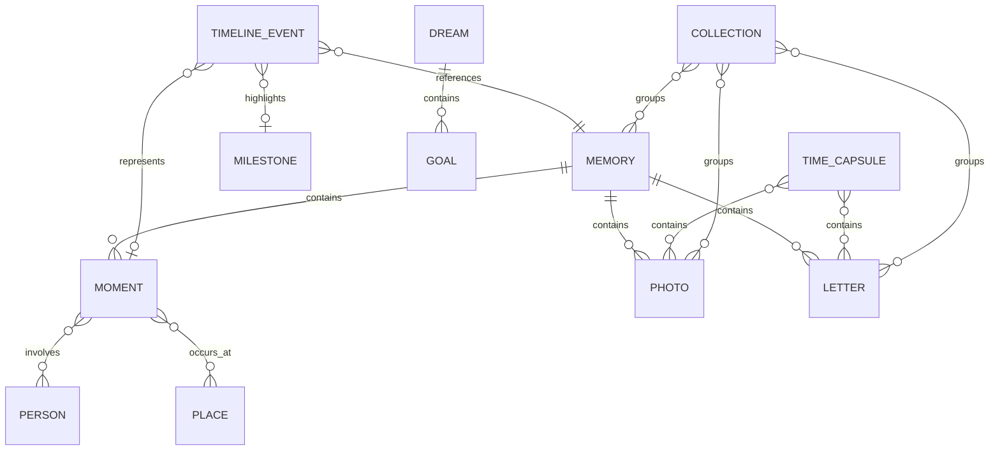
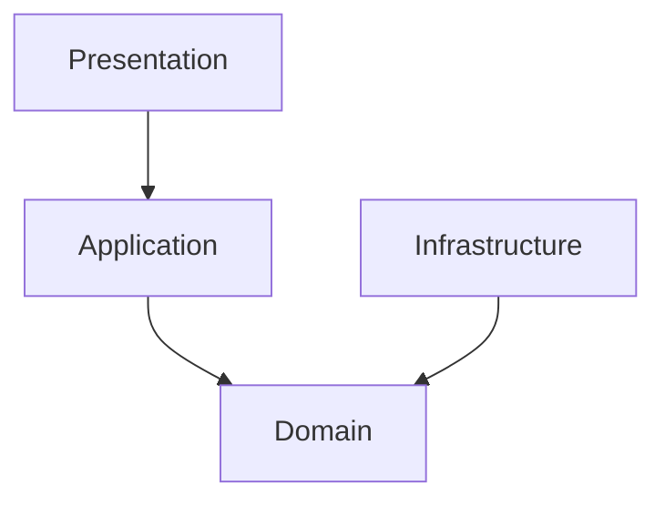
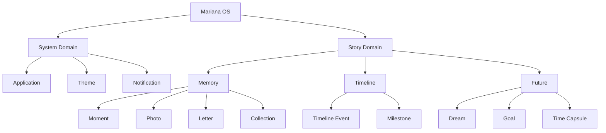

# Mariana OS — Domain Model

> *"Antes de almacenar una historia, debemos entender qué representa."*

---

# 1. Propósito

Este documento define el modelo de dominio conceptual de Mariana OS.

Su objetivo es identificar, describir y relacionar las entidades, conceptos y reglas fundamentales que forman parte del producto.

El modelo de dominio constituye el lenguaje común entre:

* Product Owner;
* Software Architect;
* Developers;
* UX Designer;
* Documentation;
* Future contributors.

El dominio representa el significado del producto, independientemente de la tecnología utilizada para implementarlo.

---

# 2. Alcance

Este documento define:

* entidades principales;
* value objects;
* agregados;
* relaciones;
* conceptos del sistema;
* reglas de dominio;
* estados;
* eventos de dominio conceptuales;
* límites entre dominio y sistema operativo.

No define directamente:

* tablas PostgreSQL;
* entidades de Entity Framework Core;
* endpoints HTTP;
* componentes Lit;
* estructuras específicas de TypeScript.

Esas decisiones pertenecen a las capas de implementación correspondientes.

---

# 3. Principio Fundamental

Mariana OS no debe modelarse como una colección de registros.

Debe modelarse como una colección de experiencias relacionadas.

La diferencia conceptual es:

```text
Base de datos

Photo
Letter
Event
Goal
Date
User


Mariana OS

Memory
   │
   ├── Moments
   ├── Photos
   ├── Letters
   ├── Places
   └── People

Timeline
   │
   ├── Past
   ├── Present
   └── Future
```

El segundo modelo representa mejor el propósito del producto.

---

# 4. Lenguaje Ubicuo

El proyecto utilizará un lenguaje común para describir conceptos del dominio.

| Concepto       | Definición                                               |
| -------------- | -------------------------------------------------------- |
| Memory         | Representación de un recuerdo significativo              |
| Moment         | Instante o experiencia específica dentro de una historia |
| Photo          | Representación de una fotografía asociada al contenido   |
| Letter         | Carta o mensaje escrito                                  |
| Timeline Event | Evento ubicado dentro de una línea temporal              |
| Dream          | Aspiración o experiencia futura deseada                  |
| Milestone      | Logro o momento relevante                                |
| Time Capsule   | Contenido asociado a una condición temporal futura       |
| Collection     | Conjunto organizado de contenido relacionado             |
| Person         | Persona relacionada con un recuerdo o contenido          |
| Place          | Lugar asociado a un momento                              |
| Application    | Aplicación disponible dentro de Mariana OS               |
| User           | Persona que interactúa con el sistema                    |
| Theme          | Configuración visual del sistema                         |
| Notification   | Información temporal presentada por el sistema           |

---

# 5. Clasificación del Dominio

El dominio puede dividirse en cuatro áreas conceptuales:

```text
Mariana OS
│
├── Memory Domain
│   ├── Memory
│   ├── Moment
│   ├── Photo
│   ├── Letter
│   └── Collection
│
├── Timeline Domain
│   ├── Timeline Event
│   ├── Milestone
│   └── Place
│
├── Future Domain
│   ├── Dream
│   ├── Goal
│   └── Time Capsule
│
└── System Domain
    ├── Application
    ├── User
    ├── Theme
    └── Notification
```

---

# 6. Core Domain

No todos los conceptos tienen el mismo valor para el producto.

El núcleo del dominio está formado por aquellos conceptos que representan directamente la historia que Mariana OS intenta preservar.

```text
Memory
Moment
Photo
Letter
Timeline Event
Dream
Time Capsule
```

Estos conceptos constituyen el corazón funcional y narrativo del producto.

---

# 7. Memory

## Definición

Una `Memory` representa un recuerdo significativo que el sistema conserva y presenta al usuario.

Una memoria no es simplemente una fotografía.

Puede contener diferentes tipos de contenido relacionados.

```text
Memory
│
├── Metadata
├── Moments
├── Photos
├── Letters
├── People
├── Places
└── Narrative
```

---

## Características

Una memoria puede tener:

* título;
* descripción;
* fecha;
* fotografías;
* cartas;
* personas relacionadas;
* lugares;
* etiquetas;
* contenido narrativo.

---

## Regla de dominio

Una fotografía puede existir sin representar una memoria completa.

Una memoria, sin embargo, debe tener algún contenido significativo asociado.

---

# 8. Moment

## Definición

Un `Moment` representa una instancia específica dentro de una memoria o historia.

Ejemplos conceptuales:

* una conversación;
* un viaje;
* una celebración;
* una fotografía específica;
* una experiencia compartida.

Un `Moment` permite representar una memoria con mayor granularidad.

```text
Memory
   │
   ├── Moment
   ├── Moment
   └── Moment
```

---

# 9. Photo

## Definición

Una `Photo` representa una imagen almacenada o referenciada por Mariana OS.

Una fotografía puede estar asociada con:

* Memory;
* Moment;
* Timeline Event;
* Collection.

---

## Metadata potencial

* título;
* fecha;
* descripción;
* ubicación;
* archivo;
* thumbnail;
* orientación;
* información contextual.

La metadata técnica no debe dominar la experiencia del usuario.

---

# 10. Letter

## Definición

Una `Letter` representa contenido escrito destinado a comunicar una idea, sentimiento, recuerdo o mensaje.

Puede representar:

* una carta;
* un mensaje especial;
* una reflexión;
* una dedicatoria;
* un mensaje futuro.

---

## Tipos conceptuales

```text
Letter
│
├── Memory Letter
├── Open Letter
├── Future Letter
└── Special Letter
```

El tipo específico no debe determinar necesariamente una entidad diferente.

Puede representarse mediante comportamiento o clasificación dentro del dominio.

---

# 11. Timeline

## Definición

La `Timeline` representa la continuidad temporal de la historia.

No debe considerarse únicamente una colección ordenada por fecha.

Su propósito es representar:

```text
Past → Present → Future
```

---

# 12. Timeline Event

Un `Timeline Event` representa un evento significativo dentro de la historia.

Puede estar relacionado con:

* Memory;
* Moment;
* Milestone;
* Dream;
* Time Capsule.

---

## Ejemplo

```text
Timeline
│
├── 2024
│   └── First Moment
│
├── 2025
│   ├── Trip
│   └── Celebration
│
├── 2026
│   └── Present
│
└── Future
    └── Shared Dream
```

---

# 13. Milestone

## Definición

Un `Milestone` representa un momento especialmente significativo.

Puede representar:

* un aniversario;
* un logro;
* una fecha importante;
* una experiencia relevante;
* un capítulo de la relación.

Un Milestone puede aparecer dentro de Timeline, pero no todos los Timeline Events son Milestones.

---

# 14. Dream

## Definición

Un `Dream` representa una aspiración o experiencia futura deseada.

Mientras una Memory representa algo que ocurrió, un Dream representa algo que podría ocurrir.

```text
Memory
What happened

Dream
What we hope happens
```

---

# 15. Goal

## Definición

Un `Goal` representa un objetivo concreto derivado de una aspiración.

La diferencia conceptual es:

```text
Dream
   ↓
Aspiration

Goal
   ↓
Concrete objective
```

Un Dream puede tener múltiples Goals.

---

# 16. Time Capsule

## Definición

Una `Time Capsule` representa contenido cuyo significado está asociado con un momento futuro.

Puede contener:

* cartas;
* fotografías;
* mensajes;
* objetivos;
* recuerdos pendientes;
* contenido multimedia.

---

## Estado conceptual

```text
Locked
   ↓
Waiting
   ↓
Available
   ↓
Opened
```

La condición exacta para desbloquearla pertenece a las reglas de dominio.

---

# 17. Collection

## Definición

Una `Collection` representa un conjunto organizado de contenido.

Puede agrupar:

* Memories;
* Photos;
* Letters;
* Moments.

Ejemplos:

```text
Our Trips
Favorite Photos
Special Moments
Letters
2025
```

Las Collections deben permitir organización sin imponer una estructura rígida al contenido.

---

# 18. Person

## Definición

Una `Person` representa una persona relacionada con uno o más elementos del dominio.

Una persona puede aparecer asociada con:

* Memory;
* Moment;
* Photo;
* Timeline Event.

La existencia de una Person dentro del dominio no implica necesariamente que sea un usuario del sistema.

---

# 19. Place

## Definición

Un `Place` representa una ubicación significativa asociada a contenido.

Puede utilizarse en:

* Memories;
* Moments;
* Photos;
* Timeline Events.

El nivel de precisión geográfica deberá depender del contenido disponible y de las necesidades de privacidad.

---

# 20. Application

## Definición

Una `Application` representa una capacidad funcional disponible dentro del sistema operativo.

Ejemplos:

```text
Photos.app
Letters.app
Timeline.app
Dreams.app
Music.app
Settings.app
```

Una Application pertenece al System Domain y no al Memory Domain.

---

# 21. Application Identity

Una aplicación puede tener:

* identifier;
* name;
* icon;
* description;
* version;
* capabilities;
* lifecycle state.

Ejemplo conceptual:

```text
Application

id: photos
name: Photos
icon: photos
version: 1.x
```

---

# 22. User

## Definición

Un `User` representa una persona autorizada a interactuar con Mariana OS.

El dominio debe mantener separación entre:

```text
User
```

y

```text
Person
```

Una Person representa una persona relacionada con la historia.

Un User representa una identidad que utiliza el sistema.

Una misma persona podría representar ambos conceptos, pero conceptualmente son diferentes.

---

# 23. Theme

## Definición

Un `Theme` representa una configuración visual del sistema.

Ejemplos:

```text
Light
Dark
```

El Theme pertenece al System Domain y no al dominio emocional.

---

# 24. Notification

## Definición

Una `Notification` representa información temporal que el sistema comunica al usuario.

Puede originarse por:

* eventos del sistema;
* aplicaciones;
* contenido disponible;
* eventos temporales.

Una Notification no debe contener lógica de negocio.

---

# 25. Relaciones Principales

El modelo conceptual puede representarse así:



Este diagrama representa relaciones conceptuales y no un esquema de base de datos.

---

# 26. Aggregate Boundaries

Los agregados permiten establecer límites de consistencia dentro del dominio.

Se proponen inicialmente los siguientes:

```text
Memory Aggregate
├── Memory
├── Moments
├── Photos
└── Letters

Timeline Aggregate
├── Timeline Event
└── Milestone

Future Aggregate
├── Dream
├── Goal
└── Time Capsule

Application Aggregate
└── Application
```

---

# 27. Memory Aggregate

La `Memory` actúa como Aggregate Root.

```text
Memory
│
├── Moment
├── Photo
└── Letter
```

Las modificaciones relacionadas con el contenido de una memoria deben respetar las reglas del agregado.

La aplicación no debería modificar directamente entidades internas sin pasar por las reglas del agregado.

---

# 28. Future Aggregate

El agregado Future contiene conceptos relacionados con contenido futuro.

```text
Future
│
├── Dream
├── Goal
└── Time Capsule
```

Esto permite separar conceptualmente el pasado del futuro.

---

# 29. Value Objects

Algunos conceptos no necesitan identidad propia.

Podrán representarse como Value Objects.

Ejemplos:

```text
DateRange
Location
MediaReference
Color
Duration
EmailAddress
ApplicationId
MemoryId
```

Los Value Objects deben ser:

* inmutables;
* comparables por valor;
* libres de identidad propia.

---

# 30. Identifiers

Las entidades que tengan identidad propia deberán disponer de un identificador.

Conceptualmente:

```text
MemoryId
PhotoId
LetterId
MomentId
DreamId
GoalId
TimeCapsuleId
ApplicationId
```

Los identificadores no deberán utilizarse para representar información de negocio.

---

# 31. Domain Rules

Las reglas de dominio deben pertenecer al dominio y no a la interfaz.

Ejemplos:

### Time Capsule

Una Time Capsule no puede abrirse antes de su condición de disponibilidad.

### Memory

Una Memory no puede publicarse sin contenido significativo.

### Goal

Un Goal debe pertenecer a un Dream cuando se encuentre dentro del Future Aggregate.

### Timeline Event

Un evento debe tener una posición temporal válida.

---

# 32. Estados de Dominio

Los conceptos que tengan ciclo de vida deberán modelar estados explícitos.

Ejemplo para Time Capsule:

```text
LOCKED
   ↓
WAITING
   ↓
AVAILABLE
   ↓
OPENED
```

Ejemplo conceptual para una Memory:

```text
DRAFT
   ↓
PUBLISHED
   ↓
ARCHIVED
```

Los estados definitivos deberán validarse durante la implementación del dominio.

---

# 33. Domain Events

El dominio podrá emitir eventos cuando ocurran hechos relevantes.

Ejemplos:

```text
MemoryCreated
MemoryPublished
PhotoAdded
LetterOpened
TimelineEventCreated
DreamCreated
GoalCompleted
TimeCapsuleUnlocked
TimeCapsuleOpened
```

Estos eventos representan hechos ocurridos dentro del dominio.

No deben confundirse con eventos visuales de UI.

---

# 34. Domain Events vs UI Events

Es importante mantener esta separación.

```text
UI Event

button-click
window-close
photo-selected
```

vs.

```text
Domain Event

MemoryPublished
GoalCompleted
TimeCapsuleUnlocked
```

Los primeros representan interacción.

Los segundos representan hechos del negocio.

---

# 35. Domain vs OS

Mariana OS contiene dos universos conceptuales diferentes:

```text
                 Mariana OS
                     │
          ┌──────────┴──────────┐
          │                     │
      OS Domain            Story Domain
          │                     │
    Applications             Memories
    Windows                  Moments
    Themes                   Photos
    Notifications            Letters
    Search                   Dreams
                             Timeline
                             Time Capsules
```

Esta separación es fundamental.

El sistema operativo proporciona el espacio.

El dominio proporciona la historia.

---

# 36. Dependencia Conceptual

La relación correcta debe ser:

```text
OS
 │
 └── hosts ──► Applications
                    │
                    └── consume ──► Domain
```

El dominio no debe conocer conceptos como:

* Window;
* Dock;
* Desktop;
* Taskbar;
* Browser;
* Lit;
* PostgreSQL.

Esto mantiene el dominio independiente de la experiencia visual y de la infraestructura.

---

# 37. Domain Services

No toda lógica pertenece naturalmente a una entidad.

Cuando una regla involucre múltiples entidades o conceptos, podrá utilizarse un Domain Service.

Ejemplos potenciales:

```text
TimelineOrderingService
MemoryPublicationService
TimeCapsuleAvailabilityService
```

Los Domain Services deben utilizarse únicamente cuando la lógica no pertenezca naturalmente a una entidad o Value Object.

---

# 38. Repositories

Los repositorios representan abstracciones para obtener y persistir agregados.

Conceptualmente:

```text
IMemoryRepository
ITimelineRepository
IDreamRepository
ITimeCapsuleRepository
```

Las interfaces pertenecen a la abstracción del dominio o aplicación.

La implementación concreta pertenece a Infrastructure.

---

# 39. Domain Independence

El dominio no debe depender directamente de:

* Entity Framework Core;
* PostgreSQL;
* ASP.NET Core;
* Lit;
* TypeScript;
* HTTP;
* Docker.

La dirección conceptual de dependencias será:



El dominio permanece en el centro.

---

# 40. Domain Model y Database

El modelo de dominio no debe convertirse automáticamente en un modelo relacional.

La persistencia debe adaptarse al dominio.

```text
Domain Model
      ↓
Persistence Mapping
      ↓
Entity Framework Core
      ↓
PostgreSQL
```

Esto evita que decisiones accidentales de almacenamiento definan el comportamiento del producto.

---

# 41. Domain Model y Frontend

El frontend tampoco debe replicar directamente las entidades de dominio.

El flujo conceptual será:

```text
Domain
   ↓
Application Layer
   ↓
API Contract
   ↓
Frontend Model
   ↓
UI Components
```

La representación visual puede ser diferente de la representación interna.

---

# 42. Application-to-Domain Relationship

Las Applications funcionan como experiencias sobre el dominio.

```text
Photos.app
   ↓
Photo / Memory

Letters.app
   ↓
Letter / Memory

Timeline.app
   ↓
Timeline Event / Memory / Milestone

Dreams.app
   ↓
Dream / Goal

Time Capsule
   ↓
Time Capsule / Letter / Photo
```

Una aplicación no debe convertirse en propietaria del dominio.

---

# 43. Domain Ownership

La propiedad conceptual debe mantenerse clara:

| Concepto       | Owner           |
| -------------- | --------------- |
| Memory         | Memory Domain   |
| Photo          | Memory Domain   |
| Letter         | Memory Domain   |
| Timeline Event | Timeline Domain |
| Milestone      | Timeline Domain |
| Dream          | Future Domain   |
| Goal           | Future Domain   |
| Time Capsule   | Future Domain   |
| Application    | System Domain   |
| Theme          | System Domain   |
| Notification   | System Domain   |

---

# 44. Extensibilidad del Modelo

El modelo debe permitir incorporar nuevos conceptos.

Por ejemplo:

```text
Memory
    ↓
Voice Note
    ↓
Video
    ↓
Location
    ↓
Shared Playlist
```

La incorporación de nuevos tipos de contenido no debería obligar a rediseñar completamente el dominio.

---

# 45. Reglas para Nuevas Entidades

Antes de introducir una nueva entidad deberán responderse las siguientes preguntas:

1. ¿Representa un concepto real del dominio?
2. ¿Tiene identidad propia?
3. ¿Tiene comportamiento o reglas?
4. ¿Necesita persistencia independiente?
5. ¿Puede ser un Value Object?
6. ¿Pertenece a un Aggregate existente?
7. ¿Tiene un Application Owner claro?
8. ¿Existe una razón para que sea una nueva entidad?

Si la respuesta no justifica una entidad independiente, deberá considerarse otra representación.

---

# 46. Anti-Patterns

Se consideran errores de modelado:

* crear una entidad por cada tabla;
* crear entidades únicamente porque existen componentes;
* mezclar conceptos de UI con conceptos de dominio;
* utilizar DTOs como entidades de dominio;
* colocar reglas de negocio dentro de componentes Lit;
* permitir que Infrastructure determine el modelo;
* crear agregados excesivamente grandes;
* utilizar Value Objects cuando existe identidad real;
* crear entidades sin comportamiento ni significado.

---

# 47. Evolución del Dominio

El Domain Model evolucionará junto con el producto.

Las modificaciones deberán evaluarse considerando:

* Product Vision;
* Product Principles;
* Roadmap;
* UX;
* Architecture.

Un cambio importante en el dominio deberá registrarse mediante un ADR cuando tenga impacto arquitectónico.

---

# 48. Modelo Conceptual Completo

La visión actual puede resumirse:



---

# 49. Relación con Applications

El modelo de aplicaciones queda conceptualmente:

```text
                    Mariana OS
                         │
                ┌────────┴────────┐
                │                 │
             System             Story
                │                 │
        ┌───────┼───────┐    ┌────┼─────┐
        │       │       │    │    │     │
      Apps    Theme  Notification │    Future
                                  │
                              Memories
                                  │
                         ┌────────┼────────┐
                         │        │        │
                       Photos  Letters  Timeline
```

Las Applications son la puerta de entrada del usuario al dominio.

No son el dominio mismo.

---

# 50. Criterio de Calidad del Modelo

El modelo de dominio se considerará saludable cuando:

* los conceptos sean comprensibles sin conocer el código;
* las entidades representen conceptos reales;
* las reglas estén cerca de los conceptos que gobiernan;
* los agregados tengan límites claros;
* el dominio sea independiente de infraestructura;
* las aplicaciones puedan evolucionar sin duplicar reglas;
* el modelo pueda crecer sin perder coherencia.

---

# 51. Principio Final

El objetivo del Domain Model no es representar todo lo que Mariana OS puede almacenar.

Su objetivo es representar lo que Mariana OS **significa**.

Una fotografía no es únicamente un archivo.

Una carta no es únicamente texto.

Una fecha no es únicamente un timestamp.

Un recuerdo no es únicamente una fila en PostgreSQL.

Cada concepto debe conservar el significado que tiene dentro de la experiencia.

> **El dominio representa la historia. La arquitectura proporciona el espacio. La interfaz permite descubrirla.**

````

### Observación arquitectónica

Con este documento aparece una separación que considero fundamental para todo lo que viene después:

```text
                    MARIANA OS
                         │
          ┌──────────────┴──────────────┐
          │                             │
      SYSTEM DOMAIN                STORY DOMAIN
          │                             │
   Applications                   Memories
   Windows                        Moments
   Themes                         Photos
   Notifications                  Letters
   Search                         Timeline
                                  Dreams
                                  Goals
                                  Time Capsules
````

Esto nos da una regla muy potente para el resto del proyecto:

**el OS es el medio; la historia es el dominio.**

Y además evita un problema bastante común: terminar construyendo un CRUD con nombres románticos. En Mariana OS, `Memory`, `Letter`, `Dream` o `TimeCapsule` tendrán **significado y reglas propias**, no serán simplemente tablas con un diseño bonito.

El siguiente documento, `008-backlog.md`, podrá convertir todo lo anterior en trabajo ejecutable: **Epics → Features → User Stories → criterios de aceptación → prioridades → dependencias**, manteniendo trazabilidad hasta la Vision, Principles y Roadmap.
